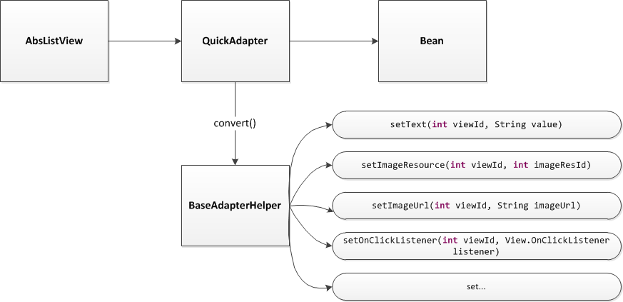
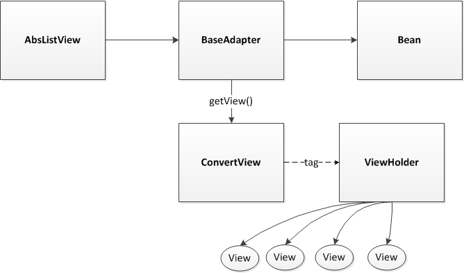
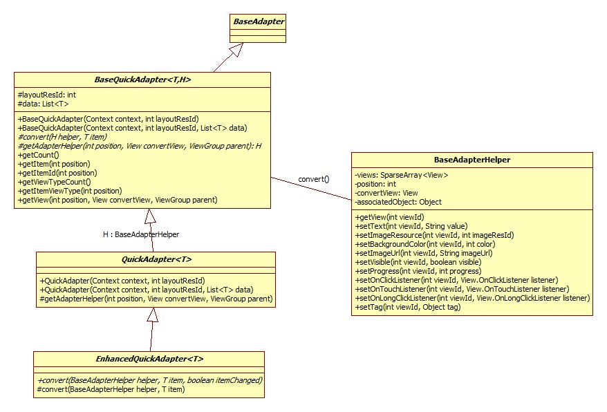
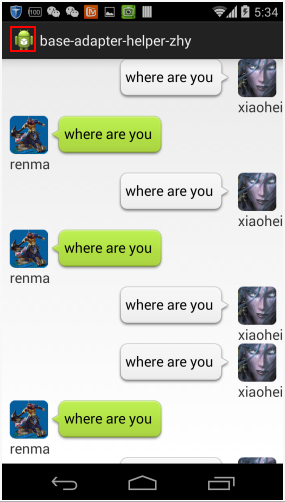

BaseAdapterHelper 源码分析
====================================
> 本文为 [Android 开源项目源码解析](https://github.com/android-cn/android-open-project-analysis) 中 BaseAdapterHelper 部分  
> 项目地址：[BaseAdapterHelper](https://github.com/JoanZapata/base-adapter-helper)，分析的版本：[71b7ae2](https://github.com/JoanZapata/base-adapter-helper/commit/71b7ae2414f01dc4d43429586196e9e9735c77aa "Commit id is 71b7ae2414f01dc4d43429586196e9e9735c77aa")，Demo 地址：[base-adapter-helper Demo](https://github.com/aosp-exchange-group/android-open-project-demo/tree/master/base-adapter-helper-demo)     
> 分析者：[hongyangAndroid](https://github.com/hongyangAndroid)，分析状态：完成，校对者：[zhengtao620](https://github.com/zhengtao620)、[Trinea](https://github.com/trinea)，校对状态：完成   

###1. 功能介绍  
####1.1. base-adapter-helper  
base-adapter-helper 是对传统的 BaseAdapter ViewHolder 模式的一个封装。主要功能就是简化我们书写 AbsListView 的 Adapter 的代码，如 ListView，GridView。  

####1.2 基本使用
```java
mListView.setAdapter(mAdapter = new QuickAdapter<Bean>(MainActivity.this, R.layout.item_list, mDatas) {

    @Override
    protected void convert(BaseAdapterHelper helper, Bean item) {
        helper.setText(R.id.tv_title, item.getTitle());
        helper.setImageUrl(R.id.id_icon, item.getUrl());
        helper.setText(R.id.tv_describe, item.getDesc());
        helper.setText(R.id.tv_phone, item.getPhone());
        helper.setText(R.id.tv_time, item.getTime());
    }
});
```

####1.3 优点
(1) 提供 QucikAdapter，省去类似 getCount() 等抽象函数的书写，只需关注 Model 到 View 的显示。  
(2) BaseAdapterHelper 中封装了大量用于为 View 操作的辅助方法，例如从网络加载图片：  
`helper.setImageUrl(R.id.iv_photo, item.getPhotoUrl());`  

####1.4 缺点
(1) 与 Picasso 耦合，想替换为其他图片缓存需要修改源码。  
可通过接口方式，供三方根据自己的图片缓存库实现图片获取，或者直接去掉`helper.setImageUrl(…)`函数。  

(2) 与内部添加的进度条偶尔，导致不支持多种类型布局  
在本文最后给出不改动进度条的解决方法。更好的实现方式应该是通过接口方式暴露，供三方自己设置。  

(3) 目前的方案也不支持`HeaderViewListAdapter`。  
总体来说这个库比较简单，实现也有待改进。 

###2. 总体设计
由于 base-adapter-helper 本质上仍然是 ViewHolder 模式，下面分别是 base-adapter-helper 的总体设计图和 ViewHolder 模式的设计图，通过两图的比较，可以看出 base-adapter-helper 对传统的`BaseAdapter`进行了初步的实现（`QuickAdapter`），并且其子类仅需实现`convert(…)`方法，在`convert(…)`中可以拿到`BaseAdapterHelper`,`BaseAdapterHelper`就相当于`ViewHolder`，但其内部提供了大量的辅助方法，用于设置 View 上的数据及事件等。

##### base-adapter-helpr
  
##### ViewHolder Pattern
  

###3. 详细设计
####3.1 类关系图
  
这是 base-adapter-helper 库的主要类关系图。  
(1) 在 BaseQucikAdapter 中实现了 BaseAdapter 中通用的抽象方法；  
(2) BaseQuickAdapter 中两个泛型，其中 T 表示数据实体类(Bean)类型，H 表示 BaseAdapterHelper 或其子类；  
(3) QucikAdapter 继承自 BaseQuickAdapter，并且传入 BaseAdapterHelper 作为 H 泛型；  
(4) EnhancedQuickAdapter 主要为`convert(…)`方法添加了一个 itemChanged 参数，表示 item 对应数据是否发生变化；  
(5) BaseAdapterHelper 为用于获取 View 并进行内容、事件设置等相关操作的辅助类。其中多数用于设置的方法都采用链式编程，方便书写；  
(6) 可以根据自己需要继承 BaseAdapterHelper 来扩展，做为 BaseQuickAdapter 子类的 H 泛型。  

###3.2 核心类源码分析
####3.2.1 BaseQucikAdapter.java 
该类继承自 BaseAdapter，完成 BaseAdapter 中部分通用抽象方法的实现，类似`ArrayAdapter`。  
该类声明了两个泛型，其中 T 表示数据实体类(Bean)类型，H 表示 BaseAdapterHelper 或其子类，主要在扩展`BaseAdapterHelper`时使用。  

#####(1) 构造方法 
```java
public BaseQuickAdapter(Context context, int layoutResId) {
    this(context, layoutResId, null);
}

public BaseQuickAdapter(Context context, int layoutResId, List<T> data) {
    this.data = data == null ? new ArrayList<T>() : new ArrayList<T>(data);
    this.context = context;
    this.layoutResId = layoutResId;
}
```
Adapter 的必须元素 ItemView 的布局文件通过 layoutResId 指定，待展示数据通过 data 指定。  

#####(2) 已经实现的主要方法
```java
@Override
public int getCount() {
    int extra = displayIndeterminateProgress ? 1 : 0;
    return data.size() + extra;
}

@Override
public int getViewTypeCount() {
    return 2;
}

@Override
public int getItemViewType(int position) {
    return position >= data.size() ? 1 : 0;
}

@Override
public View getView(int position, View convertView, ViewGroup parent) {
    if (getItemViewType(position) == 0) {
        final H helper = getAdapterHelper(position, convertView, parent);
        T item = getItem(position);
        helper.setAssociatedObject(item);
        convert(helper, item);
        return helper.getView();
    }

    return createIndeterminateProgressView(convertView, parent);
}
```
上面列出了 BaseQucikAdapter 中已经实现的主要方法，跟一般 BaseAdapter 类似，我们重点看以下几个点：  
a. 重写了`getViewTypeCount()`和`getItemViewType()`，这里 type 为 2，通过`getView(…)`可以看出，主要是为了在 AbsListView 最后显示一个进度条，这里也暴露了一个弊端，无法支持多种 Item 样式的布局；  

b. `getView(…)`方法的实现中首先通过抽象函数`getAdapterHelper(…)` 得到 BaseAdapterHelper 及 item，然后通过抽象函数`convert(…)`实现 View 和 数据的绑定。  

这样`BaseQucikAdapter`子类只需要实现抽象函数`getAdapterHelper(…)`和`convert(…)`即可。  

#####(3) 待实现的抽象方法
```java
protected abstract void convert(H helper, T item);

protected abstract H getAdapterHelper(int position, View convertView, ViewGroup parent);
```
a. convert(H helper, T item)  
通过`helper`将 View 和 数据绑定。  
`helper`参数表示 BaseQuickAdapter 或其子类，用于获取 View 并进行内容、事件设置等相关操作，由`getAdapterHelper(…)`函数返回；`item`表示对应的数据。  

b. getAdapterHelper(int position, View convertView, ViewGroup parent)  
返回 BaseQuickAdapter 或其子类，绑定 item，然后返回值传递给上面的`convert(…)`函数。  
关于`getAdapterHelper(…)`的实现见下面`QuickAdapter`的介绍。  

####3.2.2 QucikAdapter.java 
这个类继承自`BaseQuickAdapter`，没什么代码，主要用于提供一个可快速使用的 Adapter。  

对于`getAdapterHelper(…)`函数直接返回了`BaseAdapterHelper`，一般情况下直接用此类作为 Adapter 即可，如`1.2 基本使用`的示例。  
但如果你扩展了`BaseAdapterHelper`，重写`getAdapterHelper(…)`函数将其返回，即可实现自己的 Adapter。  

####3.2.3 EnhancedQuickAdapter.java 
继承自`QuickAdapter`，仅仅是为`convert(…)`添加了一个参数`itemChanged`，表示 item 对应数据是否发生变化。  
```java
@Override
protected final void convert(BaseAdapterHelper helper, T item) {
    boolean itemChanged = helper.associatedObject == null || !helper.associatedObject.equals(item);
    helper.associatedObject = item;
    convert(helper, item, itemChanged);
}

protected abstract void convert(BaseAdapterHelper helper, T item, boolean itemChanged);
```
可以看到它的实现是通过`helper.associatedObject`的`equals()`方法判断数据是否发生变化，associatedObject 即我们的 bean。在`BaseQuickAdapter.getView(…)`可以看到其赋值的代码。  

####3.2.4 BaseAdapterHelper.java 
可用于获取 View 并进行内容设置等相关操作的辅助类，该类的功能有：  
(1) 充当了 ViewHolder 角色，KV 形式保存 convertView 中子 View 的 id 及其引用，方便查找。和 convertView 通过 tag 关联；  
(2) 提供了一堆辅助方法，用于为子 View 设置内容、样式、事件等。  

#####(1) 构造相关方法 
```java
protected BaseAdapterHelper(Context context, ViewGroup parent, int layoutId, int position) {
    this.context = context;
    this.position = position;
    this.views = new SparseArray<View>();
    convertView = LayoutInflater.from(context) //
            .inflate(layoutId, parent, false);
    convertView.setTag(this);
}

public static BaseAdapterHelper get(Context context, View convertView, ViewGroup parent, int layoutId) {
    return get(context, convertView, parent, layoutId, -1);
}

/** This method is package private and should only be used by QuickAdapter. */
static BaseAdapterHelper get(Context context, View convertView, ViewGroup parent, int layoutId, int position) {
    if (convertView == null) {
        return new BaseAdapterHelper(context, parent, layoutId, position);
    }

    // Retrieve the existing helper and update its position
    BaseAdapterHelper existingHelper = (BaseAdapterHelper) convertView.getTag();
    existingHelper.position = position;
    return existingHelper;
}
```
在`QuickAdapter`中，通过上面的 5 个参数的静态函数`get(…)`得到`BaseAdapterHelper`的实例。4 个参数的`get(…)`方法，只是将 position 默认传入了 -1，即不关注 postion 方法。  

这里可以对比下我们平时在`getView`中编写的 ViewHolder 模式的代码。在一般的 ViewHolder 模式中，先判断`convertView`是否为空：  
a. 如果是，则通过`LayoutInflater` inflate 一个布局文件，然后新建 ViewHolder 存储布局中各个子 View，通过 tag 绑定该 ViewHolder 到`convertView`，返回我们的`convertView`；  
b. 否则直接得到 tag 中的 ViewHolder。  

结合`BaseQuickAdapter`的`getView(…)`代码，看下 base-adapter-helper 的实现。  
```java
@Override
public View getView(int position, View convertView, ViewGroup parent) {
    if (getItemViewType(position) == 0) {
        final H helper = getAdapterHelper(position, convertView, parent);
        T item = getItem(position);
        helper.setAssociatedObject(item);
        convert(helper, item);
        return helper.getView();
    }

    return createIndeterminateProgressView(convertView, parent);
}
```
先利用`getAdapterHelper(…)`得到`BaseAdapterHelper`或其子类，对于`QuickAdapter`而言，这个函数直接调用上面`BaseAdapterHelper`的`get(…)`函数。我们可以看到同样是先判断`convertView`是否为空，以确定是否需要新建`BaseAdapterHelper`，否则从 tag 中获取更新 position 后重用。  

在构造方法中 inflate 了一个布局作为`convertView`，并且保存 context 及 postion，将`convertView`与`BaseAdapterHelper`通过`tag`关联。  

#####(2) 几个重要的方法 
一般情况下，在我们重写`BaseQuickAdapter`的`convert(…)`时，需要得到 View，这时我们可以通过其入参`BaseAdapterHelper`的`getView(int viewId)`得到该`View`，代码如下：
```java
public <T extends View> T getView(int viewId) {
    return retrieveView(viewId);
}

@SuppressWarnings("unchecked")
protected <T extends View> T retrieveView(int viewId) {
    View view = views.get(viewId);
    if (view == null) {
        view = convertView.findViewById(viewId);
        views.put(viewId, view);
    }
    return (T) view;
}
```
通过 viewId 去 views 中进行寻找，找到则返回，找不到则添加并返回。views 是一个 SparseArray<View>，key
为 view id，value 为 view，缓存已经查找到的子 view。  
每个`convertView`与一个`BaseAdapterHelper`绑定，每个`BaseAdapterHelper`中包含一个`views`属性，`views`中存储`convertView`的子 View 的引用。  

#####(3) 辅助方法
一般情况下，通过`getView(int viewId)`拿到该`View`，然后进行赋值就可以了。但是此库考虑：既然是拿到 View 然后赋值，不如直接提供一些赋值的辅助方法。于是产生了一堆类似`setText(int viewId, String value)`的代码，内部首先通过 viewId 找到该 View，转为`TextView`然后调用`setText(value)`。部分代码如下：  
```java
public BaseAdapterHelper setText(int viewId, String value) {
    TextView view = retrieveView(viewId);
    view.setText(value);
    return this;
}

public BaseAdapterHelper setImageResource(int viewId, int imageResId) {…}

public BaseAdapterHelper setBackgroundRes(int viewId, int backgroundRes) {…}

public BaseAdapterHelper setTextColorRes(int viewId, int textColorRes) {…}

public BaseAdapterHelper setImageDrawable(int viewId, Drawable drawable) {…}

public BaseAdapterHelper setImageUrl(int viewId, String imageUrl) {…}

public BaseAdapterHelper setImageBitmap(int viewId, Bitmap bitmap) {…}

@SuppressLint("NewApi")
public BaseAdapterHelper setAlpha(int viewId, float value) {…}

public BaseAdapterHelper setVisible(int viewId, boolean visible) {…}

public BaseAdapterHelper linkify(int viewId) {…}

public BaseAdapterHelper setProgress(int viewId, int progress, int max) {…}

public BaseAdapterHelper setRating(int viewId, float rating, int max) {…}

public BaseAdapterHelper setTag(int viewId, int key, Object tag) {…}

public BaseAdapterHelper setChecked(int viewId, boolean checked) {…}

public BaseAdapterHelper setAdapter(int viewId, Adapter adapter) {…}
……
```
实现都是根据 viewId 找到 View，然后为 View 赋值的代码。  
这里只要注意下：`setImageUrl(int viewId, String imageUrl)` 这个方法，默认是通过`Picasso`去加载图片的，当然你可以更改成你项目中使用的图片加载框架 Volley，UIL 等，如果不希望继续耦合，可参考`1.4 缺点`的建议改法。   

也可以为子 View 去设置一个事件监听，部分代码如下：  
```java
public BaseAdapterHelper setOnClickListener(int viewId, View.OnClickListener listener) {
    View view = retrieveView(viewId);
    view.setOnClickListener(listener);
    return this;
}

public BaseAdapterHelper setOnTouchListener(int viewId, View.OnTouchListener listener) {…}

public BaseAdapterHelper setOnLongClickListener(int viewId, View.OnLongClickListener listener) {…}
```
这里仅仅列出一些常用的方法，如果有些控件的方法这里没有封装，可以通过`BaseAdapterHelper.getView(viewId)`得到控件去操作，或者继承`BaseAdapterHelper`实现自己的`BaseAdapterHelper`。  

###4. 杂谈
####4.1 耦合严重
(1) 与 Picasso 耦合，想替换为其他图片缓存需要修改源码  
可通过新增接口方式，供三方自己根据自己的图片缓存库实现图片获取，或者直接去掉`helper.setImageUrl(…)`函数。  

(2) 与内部添加的进度条耦合，导致不支持多种类型布局  
在下面给出不改动进度条的解决方法。更好的实现方式应该是通过接口方式暴露，供三方自己设置。  

总体来说这个库比较简单，实现也有待改进。 

####4.2 目前的方案也不支持`HeaderViewListAdapter`

####4.3 扩展多种 Item 布局
通过`3.2.1 BaseQucikAdapter.java`的分析，可以看出 base-adapter-helper 并不支持多种布局 Item 的情况，虽然大多数情况下一个种样式即可，但是要是让我用这么简单的方式写 Adapter，忽然来个多种布局 Item 的 ListView 又要 按传统的方式去写，这反差就太大了。下面我们介绍，如何在本库的基础上添加多布局 Item 的支持。

#####(1) 分析
对于多种布局的 Item，大家都清楚，需要去复写`BaseAdapter`的`getViewTypeCount()`和`getItemViewType()`。并且需要在`getView()`里面进行判断并选取不同布局文件，不同的布局也需要采用不同的`ViewHolder`。  

我们可以在构造`QucikAdapter`时，去设置`getViewTypeCount()`和`getItemViewType()`的值，进一步将其抽象为一个接口，提供几个方法，如果需要使用多种 Item 布局，进行设置即可。  

#####(2) 扩展

* 添加接口 `MultiItemTypeSupport`
```java
public interface MultiItemTypeSupport<T> {

	int getLayoutId(int position, T t);
	
	int getViewTypeCount();
	
	int getItemViewType(int postion, T t);
}
```

* 分别在`QuickAdapter`和`BaseQuickAdapter`中添加新的构造函数

`BaseQuickAdapter`新增构造函数如下：  
```java
protected MultiItemTypeSupport<T> multiItemSupport;

public BaseQuickAdapter(Context context, ArrayList<T> data,
		MultiItemTypeSupport<T> multiItemSupport) {
	this.multiItemSupport = multiItemSupport;
	this.data = data == null ? new ArrayList<T>() : new ArrayList<T>(data);
	this.context = context;
}
```

`QuickAdapter` 新增构造函数如下：  
```java
public QuickAdapter(Context context, ArrayList<T> data,
		MultiItemTypeSupport<T> multiItemSupport) {
	super(context, data, multiItemSupport);
}
```

同时肯定需要改写`BaseQuickAdapter`的`getViewTypeCount()`和`getItemViewType()`以及`getView()`函数。
```java
@Override
public int getViewTypeCount() {
	return multiItemSupport != null ? (mMultiItemSupport.getViewTypeCount() + 1) : 2);
}

@Override
public int getItemViewType(int position) {
    if (position >= data.size()) {
        return 0;
    }
    return (mMultiItemSupport != null) ? 
        mMultiItemSupport.getItemViewType(position, data.get(position)) : 1;
}

@Override
public View getView(int position, View convertView, ViewGroup parent) {
	if (getItemViewType(position) == 0) {
		return createIndeterminateProgressView(convertView, parent);
	}
	final H helper = getAdapterHelper(position, convertView, parent);
	T item = getItem(position);
	helper.setAssociatedObject(item);
	convert(helper, item);
	return helper.getView();
}
```
为了保留其原本提供的添加滚动条的功能，我们在其基础上进行修改。

* 改写`BaseAdapterHelper`的构造方法  

因为我们不同的布局，肯定要对应不同的`ViewHolder`，这里`BaseAdapterHelper`其实就扮演了`ViewHolder`的角色。我们的`BaseAdapterHelper`是在`QuickAdapter`的`getAdapterHelper`中构造的，修改后代码：

`QuickAdapter`  
```java
protected BaseAdapterHelper getAdapterHelper(int position,
		View convertView, ViewGroup parent) {

	if (mMultiItemSupport != null){
		return get(
				context,
				convertView,
				parent,
				mMultiItemSupport.getLayoutId(position, data.get(position)),
				position);
	} else {
		return get(context, convertView, parent, layoutResId, position);
	}
}
``` 

`BaseAdapterHelper`的`get`方法也需要修改。  
```java
/** This method is package private and should only be used by QuickAdapter. */
static BaseAdapterHelper get(Context context, View convertView,
		ViewGroup parent, int layoutId, int position) {
	if (convertView == null) {
		return new BaseAdapterHelper(context, parent, layoutId, position);
	}

	// Retrieve the existing helper and update its position
	BaseAdapterHelper existingHelper = (BaseAdapterHelper)convertView
			.getTag();

	if (existingHelper.layoutId != layoutId) {
		return new BaseAdapterHelper(context, parent, layoutId, position);
	}

	existingHelper.position = position;
	return existingHelper;
}
```
我们在 helper 中存储了当前的 layoutId，如果 layoutId 不一致，则重新创建。  

#####(3) 测试
下面展示核心代码
```java
mListView = (ListView) findViewById(R.id.id_lv_main);
	
MultiItemTypeSupport<ChatMessage> multiItemTypeSupport = new MultiItemTypeSupport<ChatMessage>() {
	@Override
	public int getLayoutId(int position, ChatMessage msg) {
		return msg.isComMeg() ? R.layout.main_chat_from_msg : R.layout.main_chat_send_msg;
	}

	@Override
	public int getViewTypeCount() {
		return 2;
	}

	@Override
	public int getItemViewType(int postion, ChatMessage msg) {
		return msg.isComMeg() ? ChatMessage.RECIEVE_MSG : ChatMessage.SEND_MSG;
	}
};

initDatas();

mAdapter = new QuickAdapter<ChatMessage>(ChatActivity.this, mDatas,
		multiItemTypeSupport) {
	@Override
	protected void convert(BaseAdapterHelper helper, ChatMessage item) {
		switch (helper.layoutId) {
			case R.layout.main_chat_from_msg:
				helper.setText(R.id.chat_from_content, item.getContent());
				helper.setText(R.id.chat_from_name, item.getName());
				helper.setImageResource(R.id.chat_from_icon, item.getIcon());
				break;
			case R.layout.main_chat_send_msg:
				helper.setText(R.id.chat_send_content, item.getContent());
				helper.setText(R.id.chat_send_name, item.getName());
				helper.setImageResource(R.id.chat_send_icon, item.getIcon());
				break;
		}
	}
};
	
mListView.setAdapter(mAdapter);
```
当遇到多种布局 Item 的时候，首先构造一个`MultiItemTypeSupport`接口对象，然后在`convert`中根据 layoutId，获取不同的布局进行设置。  

贴张效果图：  
  

添加多 Item 布局后的地址：[github](https://github.com/hongyangAndroid/base-adapter-helper)  